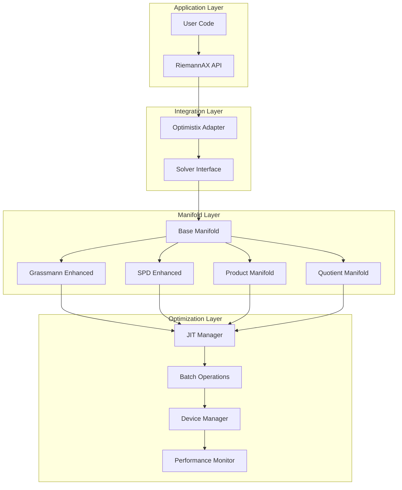
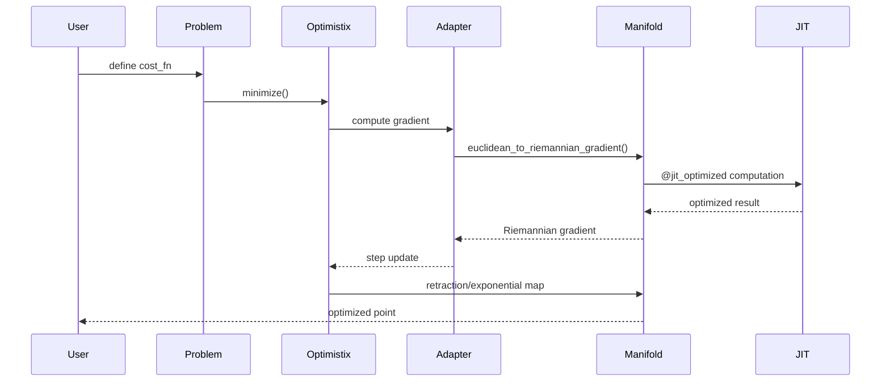
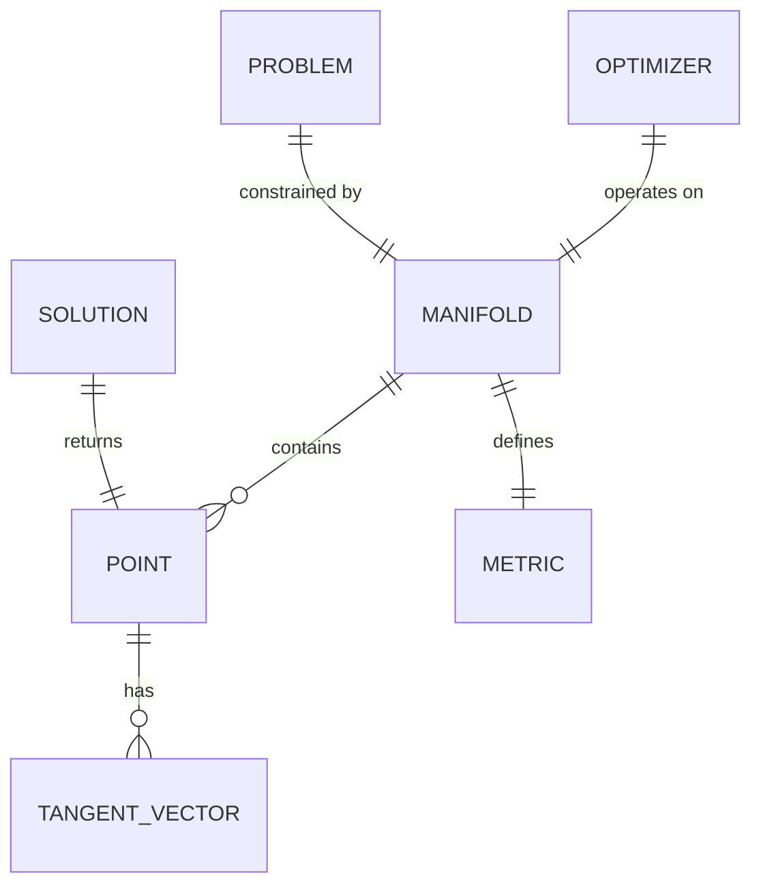

# Technical Design

## Overview

RiemannAXの数学的完全性と機能拡張を実現する包括的な技術設計です。本設計は、requirements.mdで定義された9つの主要要件に基づき、Grassmann/SPD多様体の理論的完全化、新規多様体（Product/Quotient）の追加、そしてOptimistixとの深い統合を実現します。すべての実装はJAX JITで最適化され、Python品質憲法に準拠します。

## Requirements Mapping

### Design Component Traceability

各設計コンポーネントは特定の要件に対応：

- **True Exponential Map for Grassmann** → 1.1-1.7: Grassmann多様体の数学的完全性
- **Pole Ladder for SPD** → 2.1-2.7: SPD多様体の真の平行移動
- **ProductManifold Class** → 3.1-3.7: Product Manifolds実装
- **QuotientManifold Class** → 4.1-4.7: Quotient Manifolds実装
- **OptimistixAdapter** → 5.1-5.7: Optimistix統合レイヤー
- **JIT Optimization Framework** → 6.1-6.7: JAX JIT最適化
- **Type System Enhancement** → 7.1-7.7: 型安全性強化
- **Test Infrastructure** → 8.1-8.7: 包括的テストカバレッジ
- **Documentation System** → 9.1-9.7: ドキュメントと例

### User Story Coverage

1. **研究者の数学的厳密性要求**: SVDベースの真の指数写像とPole ladder平行移動で理論的保証を提供
2. **MLエンジニアの実用性要求**: JIT最適化とバッチ処理で高速実行を実現
3. **最適化研究者の柔軟性要求**: Product/Quotient多様体で複雑な制約を表現
4. **データサイエンティストの統合要求**: Optimistixの高度なソルバーをシームレスに利用

## Architecture



### Technology Stack

研究に基づく技術選定：

- **Mathematical Backend**: JAX + NumPy (numerical computation)
- **Optimization Framework**: Optimistix 0.0.8+ (advanced solvers)
- **JIT Compilation**: JAX JIT with intelligent caching
- **Type System**: jaxtyping + Python 3.10+ type hints
- **Testing**: pytest + hypothesis (property-based testing)
- **Documentation**: Sphinx + myst-parser (mathematical notation)
- **Quality Assurance**: mypy + ruff + pre-commit hooks

### Architecture Decision Rationale

- **SVD-based Exponential Map**: 2024 Handbook Algorithm 3による最新の数値安定性手法
- **Pole Ladder Algorithm**: 3次精度でSchild's ladder (1次精度)より優れた収束性
- **Composite Pattern for Product**: 柔軟な多様体組み合わせと効率的な操作委譲
- **Horizontal Lift for Quotient**: 理論的に正確な商構造の実装
- **FunctionInfo Interface**: Optimistixの勾配・ヘシアン情報を活用

### Data Flow



## Components and Interfaces

### Backend Services & Method Signatures

#### Enhanced Grassmann Manifold
```python
class Grassmann(BaseManifold):
    def _exp_svd(self, p: Array, xi: Array) -> Array:  # True exponential via SVD
    def _log_svd(self, p: Array, q: Array) -> Array:   # True logarithm via SVD
    def _handle_cutlocus(self, s: Array) -> Array:     # Cut locus detection
    def _stabilized_qr(self, m: Array) -> Array:       # Numerically stable QR
```

#### Enhanced SPD Manifold
```python
class SymmetricPositiveDefinite(BaseManifold):
    def _pole_ladder(self, x: Array, y: Array, xi: Array, n_steps: int = 3) -> Array:  # 3rd order accuracy
    def _schild_ladder(self, x: Array, y: Array, xi: Array) -> Array:  # 1st order fallback
    def _affine_invariant_transp(self, x: Array, y: Array, xi: Array) -> Array:  # Closed form
    def _bures_wasserstein_transp(self, x: Array, y: Array, xi: Array) -> Array:  # Special case
```

#### Product Manifold
```python
class ProductManifold(BaseManifold):
    def __init__(self, manifolds: Tuple[BaseManifold, ...]):
    def _split_point(self, x: Array) -> Tuple[Array, ...]:  # Decompose into components
    def _combine_points(self, xs: Tuple[Array, ...]) -> Array:  # Combine components
    def exp(self, p: ProductPoint, xi: ProductTangent) -> ProductPoint:  # Component-wise exp
    def inner(self, p: ProductPoint, u: ProductTangent, v: ProductTangent) -> float:  # Sum of inners
```

#### Quotient Manifold
```python
class QuotientManifold(BaseManifold):
    def __init__(self, total_space: BaseManifold, fiber_dimension: int):
    def _horizontal_projection(self, p: Array, xi: Array) -> Array:  # Project to horizontal space
    def _horizontal_lift(self, p: Array, xi_h: Array) -> Array:  # Lift from quotient
    def _equivalence_class_representative(self, p: Array) -> Array:  # Canonical form
```

#### Optimistix Integration
```python
class ManifoldMinimizer(optx.AbstractMinimiser):
    def __init__(self, manifold: BaseManifold, base_solver: optx.AbstractMinimiser):
    def _convert_gradient(self, euclidean_grad: Array, point: Array) -> Array:  # Euclidean→Riemannian
    def step(self, fn_info: optx.FunctionInfo, state: State) -> Tuple[Array, State]:
    def _ensure_constraint(self, point: Array) -> Array:  # Project to manifold
```

### Frontend Components

| Component | Responsibility | Key Methods |
|-----------|----------------|-------------|
| `RiemannianProblem` | Problem definition | `cost_fn`, `manifold`, `euclidean_grad_fn` |
| `OptimistixSolver` | Solver wrapper | `minimize()`, `least_squares()` |
| `ManifoldFactory` | Manifold creation | `create_grassmann()`, `create_product()` |
| `GradientConverter` | Gradient transformation | `euclidean_to_riemannian()` |

### API Endpoints

| Class.Method | Purpose | Input Types | Output Type |
|--------------|---------|-------------|-------------|
| `Grassmann.exp()` | True exponential map | `(Array, Array)` | `Array` |
| `SPD.transp()` | Parallel transport | `(Array, Array, Array)` | `Array` |
| `ProductManifold.proj()` | Component projection | `Tuple[Array,...]` | `Tuple[Array,...]` |
| `QuotientManifold.dist()` | Quotient distance | `(Array, Array)` | `float` |
| `ManifoldMinimizer.minimize()` | Constrained optimization | `(Callable, Array)` | `Solution` |

## Data Models

### Domain Entities

1. **ManifoldPoint**: Abstract representation of points on manifolds
2. **TangentVector**: Vectors in tangent spaces
3. **OptimizationState**: Solver state with manifold constraints
4. **ConvergenceInfo**: Optimization convergence metrics
5. **ManifoldMetadata**: Dimension, curvature, and type information

### Entity Relationships



### Data Model Definitions

```python
from dataclasses import dataclass
from typing import Optional, Tuple, Union
from jaxtyping import Array, Float

@dataclass
class ManifoldPoint:
    """Point on a Riemannian manifold"""
    data: Float[Array, "..."]
    manifold_type: str
    is_valid: bool = True

@dataclass
class TangentVector:
    """Vector in tangent space at a point"""
    data: Float[Array, "..."]
    base_point: ManifoldPoint
    norm: Optional[float] = None

@dataclass
class OptimizationResult:
    """Result from manifold optimization"""
    optimal_point: ManifoldPoint
    optimal_value: float
    gradient_norm: float
    iterations: int
    converged: bool
    message: str

@dataclass
class ProductPoint:
    """Point on product manifold"""
    components: Tuple[Array, ...]

@dataclass
class QuotientPoint:
    """Equivalence class representative"""
    representative: Array
    fiber_coords: Optional[Array] = None
```

### Database Schema

メモリ内データ構造（永続化なし）：

```python
# Manifold Registry
MANIFOLD_REGISTRY = {
    "sphere": Sphere,
    "grassmann": Grassmann,
    "stiefel": Stiefel,
    "so": SpecialOrthogonal,
    "spd": SymmetricPositiveDefinite,
    "product": ProductManifold,
    "quotient": QuotientManifold,
}

# JIT Cache Structure
JIT_CACHE = {
    "function_hash": {
        "compiled_fn": Callable,
        "static_args": Tuple,
        "hit_count": int,
        "compile_time": float,
    }
}
```

## Error Handling

包括的エラー処理戦略：

```python
class ManifoldError(Exception):
    """Base exception for manifold operations"""

class ConstraintViolationError(ManifoldError):
    """Point violates manifold constraints"""

class NumericalInstabilityError(ManifoldError):
    """Numerical instability detected"""

class ConvergenceError(ManifoldError):
    """Optimization failed to converge"""

# Error recovery patterns
def safe_exponential_map(manifold, point, tangent):
    try:
        return manifold.exp(point, tangent)
    except NumericalInstabilityError:
        # Fall back to retraction
        return manifold.retr(point, tangent)
```

## Security Considerations

- **Input Validation**: 型チェックと範囲検証をすべての公開APIで実施
- **Numerical Bounds**: オーバーフロー/アンダーフロー防止のための数値境界チェック
- **Memory Safety**: JAXの不変性により、メモリ安全性を保証
- **Deterministic Computation**: 乱数シードの適切な管理

## Performance & Scalability

### Performance Targets

| Metric | Target | Measurement | Requirement Ref |
|--------|--------|-------------|-----------------|
| Grassmann exp (n=100, p=10) | < 5ms | JIT compiled | 1.6 |
| SPD transp (n=100) | < 10ms | Pole ladder | 2.7 |
| Product manifold ops | < Σ(component times) | Component-wise | 3.2 |
| Optimistix integration | < 10% overhead | vs native | 5.6 |
| Batch size scaling | Linear | vmap performance | 6.4 |

### Caching Strategy

- **JIT Compilation Cache**: LRUキャッシュ (size=10000) for compiled functions
- **Static Arguments**: Dimension parameters cached as static_argnums
- **Batch Operations**: vmap compilation reused across batch sizes

### Scalability Approach

- **Horizontal**: vmapによるバッチ並列化
- **Vertical**: 大規模行列向けのメモリ効率アルゴリズム
- **Device**: GPU/TPU透過的サポート

## Testing Strategy

### Risk Matrix

| Area | Risk | Must | Optional | Ref |
|------|------|------|----------|-----|
| Mathematical Correctness | H | Unit, Property | Symbolic | 1.1-4.7 |
| Numerical Stability | H | Edge cases, Conditioning | Stress | 1.4, 2.7 |
| Optimistix Integration | M | Integration, Contract | E2E | 5.1-5.7 |
| JIT Performance | M | Benchmark, Profile | Load | 6.7 |
| Type Safety | L | mypy, Runtime | Static analysis | 7.1-7.5 |

### Minimal by Layer

- **Unit Tests**: 各多様体メソッドの数学的性質検証
  - `test_grassmann_exp_log_inverse.py`
  - `test_spd_parallel_transport_isometry.py`
- **Integration Tests**: 多様体とOptimistixの統合
  - `test_optimistix_manifold_minimization.py`
- **Property Tests**: Hypothesis使用の不変量検証
  - `test_product_manifold_properties.py`
- **JIT Tests**: コンパイル正確性とパフォーマンス
  - `test_grassmann_jit.py`, `test_spd_jit.py`

### CI Gates

| Stage | Run | Gate | SLA |
|-------|-----|------|-----|
| PR | mypy + ruff + pytest | Fail = block | ≤3m |
| Main | Full test suite + coverage | >90% coverage | ≤5m |
| Nightly | Performance benchmarks | No regression | ≤10m |

### Exit Criteria

- すべてのテスト合格（エラー率 0%）
- 型チェック完全通過（mypy strict mode）
- コードカバレッジ >95%
- パフォーマンス目標達成
- ドキュメント完成度 100%
