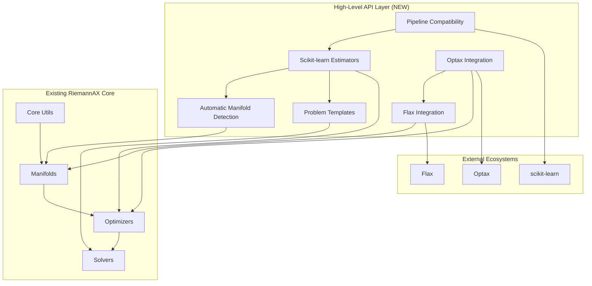
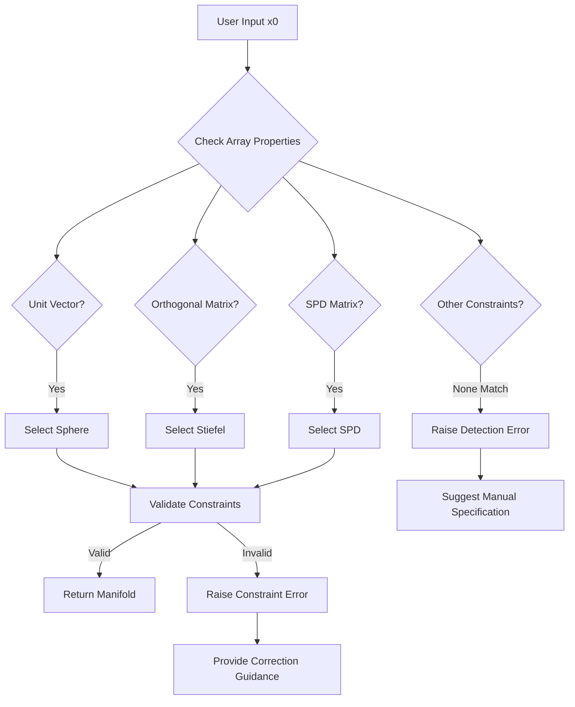
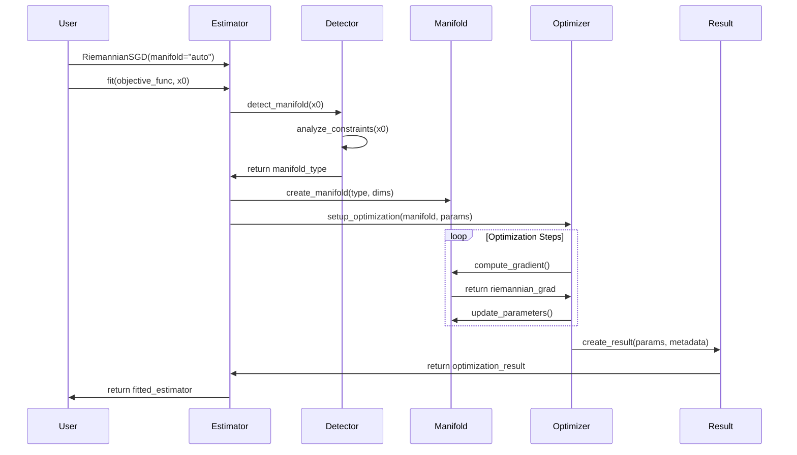
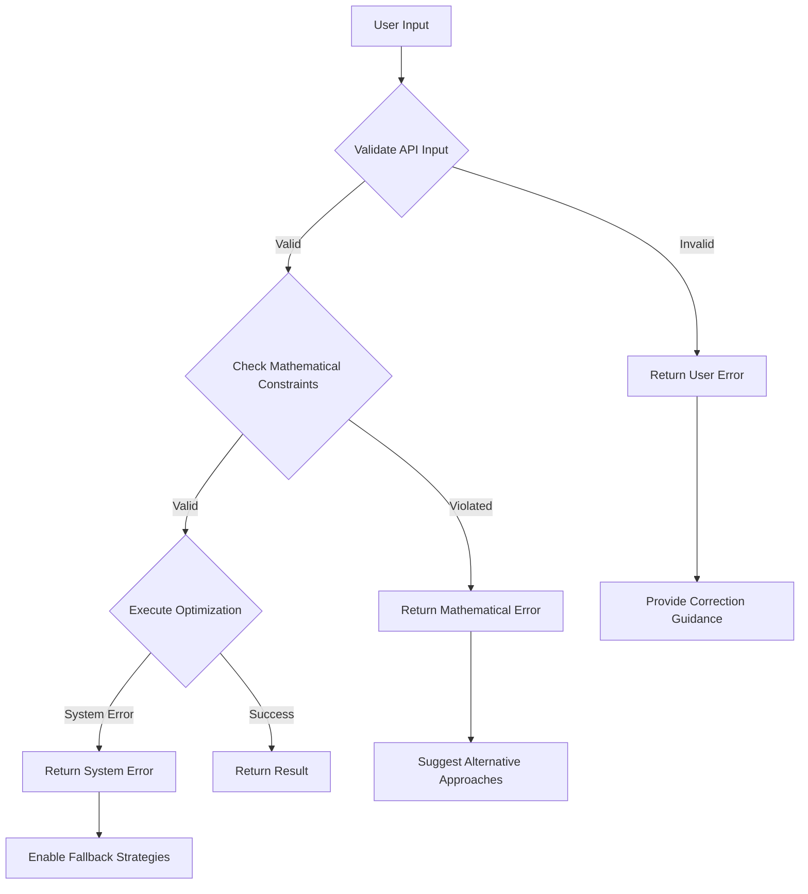

# Technical Design Document

## Overview

This feature delivers production-ready, high-level APIs for RiemannAX that provide scikit-learn compatible interfaces, practical problem templates, and seamless integration with the JAX machine learning ecosystem. Machine learning practitioners, researchers, and engineers will utilize this for streamlined Riemannian optimization workflows without requiring deep differential geometry expertise.

The implementation extends the existing RiemannAX low-level manifold optimization library by adding high-level abstraction layers, automatic manifold detection capabilities, and comprehensive ecosystem integration while preserving the library's core performance advantages through JAX compilation and hardware acceleration.

### Goals

- Provide scikit-learn compatible estimator interfaces for Riemannian optimization
- Enable automatic manifold detection from parameter structure and constraints
- Deliver practical problem templates for common manifold optimization tasks
- Achieve seamless integration with Optax, Flax, and scikit-learn ecosystems
- Maintain 90% performance of low-level API while providing high-level convenience

### Non-Goals

- Replacing or modifying existing low-level manifold implementations
- Adding new manifold types beyond current RiemannAX support
- Implementing custom optimization algorithms beyond existing ones
- Creating standalone machine learning models outside manifold optimization scope

## Architecture

### Existing Architecture Analysis

RiemannAX follows a modular, functional programming architecture built on JAX's ecosystem with:

- **Core Framework**: JAX for automatic differentiation, JIT compilation, and hardware acceleration
- **Manifold Layer**: Abstract base classes with concrete implementations (Sphere, Grassmann, Stiefel, SO(n), SPD)
- **Optimizer Layer**: Riemannian adaptations of SGD, Adam, and Momentum algorithms
- **Problem/Solver Layer**: High-level optimization interfaces and result structures

**Existing domain boundaries preserved:**
- Core utilities (JIT, performance, device management) remain unchanged
- Manifold implementations maintain their interface contracts
- Optimizer algorithms preserve their functional signatures
- Problem definition framework extends naturally

**Integration points maintained:**
- Factory pattern for manifold creation continues to work
- JIT compilation system remains globally configurable
- Performance monitoring integrates with new high-level operations

### High-Level Architecture



### Technology Alignment

The feature aligns with RiemannAX's existing technology stack:

**Preserved Technologies:**
- JAX ecosystem for computation and compilation
- Functional programming patterns with immutable data
- Factory pattern for manifold creation
- JIT optimization and performance monitoring

**New Dependencies Introduced:**
- Enhanced scikit-learn integration for estimator interfaces
- Deeper Optax integration for optimizer compatibility
- Flax NNX integration for neural network module constraints with mutable state management

**Architecture Pattern Maintained:**
- Modular design with clear separation of concerns
- Functional composition over object-oriented inheritance
- Performance-first design with optional convenience layers

### Key Design Decisions

**Decision 1: Adapter Pattern for Ecosystem Integration**
- **Context**: Need to integrate with multiple external libraries while preserving RiemannAX's functional design
- **Alternatives**: Direct inheritance, wrapper classes, or complete reimplementation
- **Selected Approach**: Adapter pattern that translates between RiemannAX functional interfaces and external object-oriented APIs
- **Rationale**: Maintains clean separation between RiemannAX core and external dependencies, enabling independent evolution
- **Trade-offs**: Additional abstraction layer but preserves modularity and testability

**Decision 2: Hierarchical API Design**
- **Context**: Users need both simple interfaces and full control over optimization parameters
- **Alternatives**: Single monolithic API, multiple separate APIs, or configuration-driven approach
- **Selected Approach**: Three-tier API hierarchy: convenience functions, estimator classes, and direct low-level access
- **Rationale**: Provides multiple entry points matching different user expertise levels and use cases
- **Trade-offs**: More complex API surface but better user experience across skill levels

**Decision 3: Static Manifold Detection with Runtime Validation**
- **Context**: Automatic manifold detection needs to be both fast and accurate
- **Alternatives**: Machine learning-based detection, heuristic rules, or user specification only
- **Selected Approach**: Static analysis of array properties with comprehensive runtime validation
- **Rationale**: Predictable behavior, fast execution, and clear error messages when detection fails
- **Trade-offs**: Limited to well-defined mathematical structures but provides reliable automation

## System Flows

### Automatic Manifold Detection Flow



### High-Level Estimator Workflow



## Requirements Traceability

| Requirement | Component | Interface | Implementation |
|-------------|-----------|-----------|----------------|
| 1.1-1.5 Scikit-learn API | `RiemannianEstimator` | `fit()`, `get_params()`, `set_params()` | Adapter pattern with BaseEstimator |
| 2.1-2.6 Auto Detection | `ManifoldDetector` | `detect_manifold()`, `validate_constraints()` | Static analysis with runtime checks |
| 3.1-3.6 Problem Templates | `MatrixCompletion`, `ManifoldPCA`, etc. | Scikit-learn transformer interface | Domain-specific estimator classes |
| 4.1-4.5 Optax Integration | `OptaxAdapter` | `init()`, `update()`, `apply_updates()` | Functional interface translation |
| 5.1-5.5 Flax NNX Integration | `FlaxNNXManifoldModule` | `nnx.Module` inheritance with constraint variables | Custom NNX modules with mutable constraint state |
| 6.1-6.5 Pipeline Compatibility | All estimators | Standard transformer/estimator methods | Mixin-based implementation |
| 7.1-7.5 Performance | `PerformanceWrapper` | Transparent JIT preservation | Zero-overhead abstraction principle |
| 8.1-8.5 Error Handling | `ValidationSystem` | Comprehensive validation chain | Layered validation with clear messages |

## Components and Interfaces

### High-Level API Layer

#### RiemannianEstimator

**Responsibility & Boundaries**
- **Primary Responsibility**: Provides scikit-learn compatible interface for Riemannian optimization
- **Domain Boundary**: Bridge between external ML ecosystem and RiemannAX core functionality
- **Data Ownership**: Manages optimization parameters, results, and fitted state
- **Transaction Boundary**: Single optimization run with parameter persistence

**Dependencies**
- **Inbound**: User applications, scikit-learn pipelines, hyperparameter tuning tools
- **Outbound**: ManifoldDetector, RiemannAX optimizers, manifold factories
- **External**: scikit-learn BaseEstimator, validation utilities

**Contract Definition**

```typescript
interface RiemannianEstimatorService {
  // Core scikit-learn estimator interface
  fit(objective_func: Callable, initial_point: Array): RiemannianEstimator;
  get_params(deep: boolean = true): Dict[str, Any];
  set_params(**params: Any): RiemannianEstimator;

  // Extended Riemannian-specific interface
  score(objective_func: Callable, X: Array): float;
  predict(X: Array): Array;
}
```

**Preconditions**:
- Objective function must be JAX-compatible and differentiable
- Initial point must satisfy basic array constraints

**Postconditions**:
- Returns fitted estimator with optimized parameters
- Maintains scikit-learn estimator contract compliance

**State Management**:
- **States**: [unfitted, fitting, fitted, failed]
- **Persistence**: Fitted parameters and optimization metadata
- **Concurrency**: Thread-safe for read operations, exclusive write during fitting

#### ManifoldDetector

**Responsibility & Boundaries**
- **Primary Responsibility**: Automatically detects appropriate manifold from parameter structure
- **Domain Boundary**: Mathematical constraint analysis and manifold classification
- **Data Ownership**: Detection rules, constraint validation logic, and error diagnostics

**Contract Definition**

```typescript
interface ManifoldDetectorService {
  detect_manifold(x: Array, constraints: Optional[Dict] = None): ManifoldType;
  validate_constraints(x: Array, manifold_type: ManifoldType): ValidationResult;
  suggest_manifold(x: Array): List[ManifoldCandidate];
}

interface ValidationResult {
  is_valid: boolean;
  violations: List[ConstraintViolation];
  suggestions: List[str];
}
```

**Detection Strategy**:
- **Unit Vector Detection**: Check norm equality and dimension constraints
- **Orthogonal Matrix Detection**: Verify orthonormality conditions
- **SPD Detection**: Check symmetry and positive definiteness
- **Fallback Strategy**: Provide ranked suggestions when detection is ambiguous

### Problem Templates Layer

#### MatrixCompletion

**Responsibility & Boundaries**
- **Primary Responsibility**: Low-rank matrix completion using fixed-rank manifold optimization
- **Domain Boundary**: Matrix completion problems with missing data patterns
- **Data Ownership**: Incomplete matrix data, completion masks, and fitted low-rank factors

**Contract Definition**

```typescript
interface MatrixCompletionService {
  fit(X_incomplete: Array, mask: Array): MatrixCompletion;
  transform(X_incomplete: Array, mask: Array): Array;
  fit_transform(X_incomplete: Array, mask: Array): Array;

  // Problem-specific methods
  reconstruction_error(): float;
  rank_selection(max_rank: int): int;
}
```

**Mathematical Foundation**:
- **Manifold**: Fixed-rank matrix manifold
- **Objective**: Minimize ||P_Ω(X - UV^T)||_F^2 where Ω is observed entries
- **Constraints**: U, V maintain orthogonality constraints through manifold structure

#### ManifoldPCA

**Responsibility & Boundaries**
- **Primary Responsibility**: Principal component analysis on data living on Riemannian manifolds
- **Domain Boundary**: Dimensionality reduction for manifold-valued data
- **Data Ownership**: Manifold data points, principal directions, and explained variance ratios

**Contract Definition**

```typescript
interface ManifoldPCAService {
  fit(X: Array, manifold_type: str): ManifoldPCA;
  transform(X: Array): Array;
  fit_transform(X: Array): Array;

  // PCA-specific attributes
  components_: Array;
  explained_variance_ratio_: Array;
  mean_: ManifoldPoint;
}
```

### Ecosystem Integration Layer

#### OptaxAdapter

**Responsibility & Boundaries**
- **Primary Responsibility**: Bridges RiemannAX Riemannian optimizers with Optax ecosystem
- **Domain Boundary**: Gradient processing and optimization algorithm composition
- **Data Ownership**: Optimizer state transformations and gradient processing chains

**Contract Definition**

```typescript
interface OptaxAdapterService {
  // Optax-compatible interface
  init(params: PyTree): OptState;
  update(grads: PyTree, state: OptState, params: PyTree): [PyTree, OptState];

  // Riemannian-specific extensions
  project_gradients(grads: PyTree, manifold: Manifold): PyTree;
  chain_with_optax(optax_optimizer: Any): ComposedOptimizer;
}
```

**Integration Strategy**:
- **Gradient Transformation**: Convert Euclidean gradients to Riemannian gradients
- **State Management**: Translate between Optax and RiemannAX state representations
- **Chaining Support**: Enable composition with existing Optax transformations

#### FlaxNNXManifoldModule

**Responsibility & Boundaries**
- **Primary Responsibility**: Provides Flax NNX-compatible neural network modules with manifold constraints
- **Domain Boundary**: Neural network parameter constraint enforcement using NNX's mutable state system
- **Data Ownership**: Manifold-constrained parameters, constraint state variables, and validation metadata

**Contract Definition**

```typescript
interface FlaxNNXManifoldModuleService extends nnx.Module {
  __init__(manifold_type: str, param_shape: Tuple, rngs: nnx.Rngs): void;
  __call__(inputs: Array): Array;

  // Manifold-specific methods with NNX state management
  project_params(): void;  // Mutates internal param state
  validate_constraints(): ConstraintStatus;
  get_constraint_penalty(): float;

  // NNX-specific constraint variables
  constraint_violations: nnx.Variable;
  projection_count: nnx.Variable;
}
```

**Flax NNX Integration Approach**:
- **Parameter Initialization**: Use custom nnx.Variable types for manifold-constrained parameters
- **Mutable State Management**: Leverage NNX's reference semantics for constraint tracking
- **Forward Pass**: Standard computation with automatic constraint projection using mutable state
- **Constraint Variables**: Track violations and projections through custom Variable types
- **Serialization**: Maintain NNX checkpoint compatibility with constraint state preservation

## Data Models

### Domain Model

**Core Concepts**:

**OptimizationResult Aggregate**:
- **Identity**: Unique optimization run identifier
- **Lifecycle**: Created during optimization, immutable after completion
- **Invariants**: Must contain valid optimized parameters and convergence metadata

**EstimatorState Entity**:
- **Identity**: Estimator instance with fitted/unfitted states
- **Lifecycle**: Unfitted → Fitting → Fitted → (optionally) Refitted
- **Business Rules**: Cannot make predictions before fitting, parameters immutable during fitting

**ManifoldConstraint Value Object**:
- **Properties**: Constraint type, tolerance, validation function
- **Immutability**: Fixed for manifold type, cannot be modified
- **Validation**: Must be mathematically consistent with manifold definition

### Logical Data Model

**Structure Definition**:

```typescript
// Core optimization data structures
interface OptimizationResult {
  optimized_params: Array;
  objective_value: float;
  convergence_status: ConvergenceStatus;
  iteration_count: int;
  metadata: OptimizationMetadata;
}

interface EstimatorParameters {
  manifold_type: str | ManifoldType;
  optimizer_name: str;
  learning_rate: float;
  max_iterations: int;
  tolerance: float;
  random_state: int | None;
}

interface ManifoldDetectionResult {
  detected_type: ManifoldType;
  confidence: float;
  constraints_satisfied: boolean;
  validation_errors: List[str];
  alternatives: List[ManifoldCandidate];
}
```

**Consistency & Integrity**:
- **Transaction Boundaries**: Single optimization run maintains consistency
- **Referential Integrity**: Manifold type must exist in supported manifolds registry
- **Temporal Aspects**: Optimization results include timestamp and iteration history

## Error Handling

### Error Strategy

**Layered Validation Approach**: Implement validation at API boundary, business logic, and mathematical constraint levels with specific error types and recovery strategies for each layer.

### Error Categories and Responses

**User Input Errors** (400-level):
- **Invalid Parameters**: Unsupported manifold types → Clear error with available options and examples
- **Constraint Violations**: Data doesn't satisfy manifold constraints → Diagnostic information with correction guidance
- **Dimension Mismatches**: Incompatible array shapes → Expected vs actual dimensions with reshape suggestions

**Mathematical Errors** (422-level):
- **Optimization Convergence**: Failed to converge → Diagnostic with gradient norms, step sizes, and parameter suggestions
- **Numerical Instability**: Condition number issues → Warning with alternative algorithms or preprocessing recommendations
- **Manifold Constraint Violations**: Parameters drift off manifold → Automatic projection with constraint violation logging

**System Integration Errors** (500-level):
- **JAX Compilation**: JIT compilation failures → Fallback to non-JIT with performance warning
- **Hardware Limitations**: Memory or compute exhaustion → Suggest batch size reduction or hardware upgrade
- **External Library Compatibility**: Version conflicts → Clear dependency version requirements



### Monitoring

**Error Tracking**: Structured logging with error correlation IDs, context preservation, and integration with performance monitoring for optimization failure analysis.

**Health Monitoring**: Continuous validation of mathematical constraints, performance regression detection, and automated testing of ecosystem integration points.

## Testing Strategy

### Unit Tests
- **ManifoldDetector**: Constraint validation accuracy, edge case handling, error message clarity
- **EstimatorAdapters**: Scikit-learn interface compliance, parameter validation, state management
- **OptaxIntegration**: Gradient transformation correctness, state conversion accuracy
- **FlaxNNXModules**: Parameter constraint enforcement using mutable state, gradient projection, NNX serialization compatibility
- **ProblemTemplates**: Mathematical correctness, convergence properties, edge case robustness

### Integration Tests
- **Scikit-learn Pipelines**: End-to-end pipeline execution, parameter passing, cross-validation compatibility
- **Optax Chaining**: Composition with standard Optax optimizers, gradient flow validation
- **Flax NNX Training**: Neural network training with constraints using NNX modules, checkpoint loading/saving with constraint state
- **Performance Preservation**: Benchmark high-level vs low-level API performance ratios
- **Ecosystem Compatibility**: Version compatibility across JAX, scikit-learn, Optax, Flax NNX

### End-to-End Tests
- **Complete ML Workflows**: Data loading → preprocessing → optimization → evaluation → deployment
- **Problem Template Scenarios**: Matrix completion, PCA, covariance estimation workflows
- **Multi-library Integration**: Complex pipelines using all supported external libraries
- **Performance Regression**: Automated benchmarking with historical comparison
- **Documentation Examples**: All code examples in documentation must pass as tests

### Performance Tests
- **API Overhead**: Measure high-level API overhead vs direct low-level calls
- **Memory Usage**: Profile memory consumption with batch operations and JIT compilation
- **Scaling Characteristics**: Test performance across problem sizes and hardware configurations
- **Convergence Rates**: Validate optimization efficiency across different manifold types

## Security Considerations

**Input Validation**: Comprehensive sanitization of user-provided objective functions to prevent code injection, with strict typing and JAX function validation.

**Memory Safety**: Protection against memory exhaustion through input size validation, batch size limits, and graceful degradation strategies.

**Dependency Security**: Regular security audits of external dependencies (scikit-learn, Optax, Flax) with automated vulnerability scanning and version pinning.

## Performance & Scalability

**Target Metrics**:
- High-level API overhead: <10% compared to direct low-level calls
- Memory efficiency: <20% additional memory usage for abstraction layers
- JIT compilation preservation: 100% of low-level JIT benefits maintained
- Batch processing: Linear scaling with batch size across all estimators

**Scaling Approaches**:
- **Horizontal Scaling**: JAX's vmap for batch processing across multiple optimization problems
- **Vertical Scaling**: GPU/TPU utilization through preserved JIT compilation and device placement
- **Memory Optimization**: Lazy evaluation patterns and streaming for large-scale problem templates

**Caching Strategies**:
- **JIT Cache Management**: Preserve existing RiemannAX JIT cache infrastructure
- **Manifold Detection Cache**: Cache detection results for repeated array patterns
- **Parameter Validation Cache**: Cache validation results for frequently used parameter combinations
