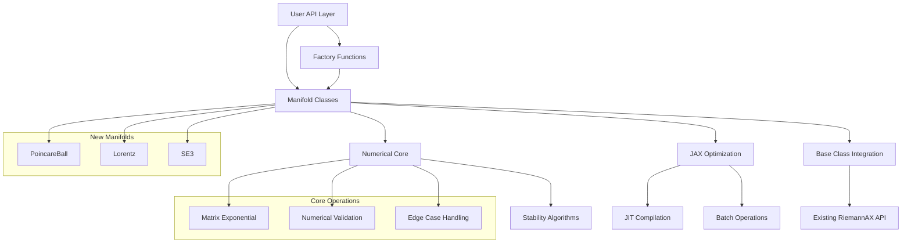
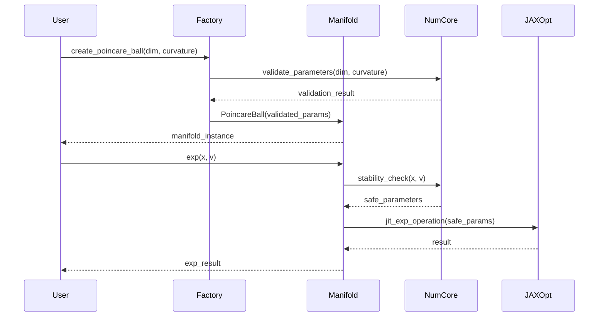
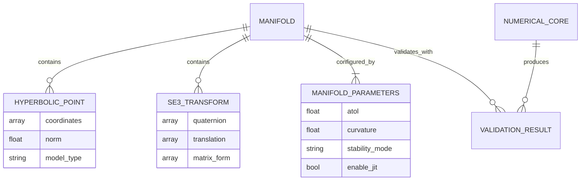

# Technical Design

## Overview

This design implements hyperbolic manifolds (Poincaré Ball and Lorentz models) and SE(3) Lie groups in RiemannAX to capture critical market opportunities in computer vision and robotics. The implementation prioritizes numerical stability, performance optimization through JAX's JIT compilation, and seamless integration with existing RiemannAX architecture.

Based on recent research findings (2024), the design addresses known numerical stability challenges in hyperbolic geometry and leverages mature SE(3) implementation patterns from the JAX ecosystem, particularly drawing insights from the jaxlie library.

## Requirements Mapping

### Design Component Traceability
Each design component addresses specific requirements from requirements.md:

- **Hyperbolic Manifold Classes** → Requirement 1: Poincaré Ball and Lorentz model implementations
- **SE(3) Lie Group Implementation** → Requirement 2: SE(3) manifold with SO(3) integration
- **Manifold Base Class Integration** → Requirement 3: API consistency with existing patterns
- **JAX Optimization Framework** → Requirement 4: JIT compilation and hardware acceleration
- **Numerical Stability Layer** → Requirement 5: Stable algorithms and validation
- **Testing and Documentation** → Requirement 6: Comprehensive quality assurance

### User Story Coverage

**Geometric Deep Learning Researcher**: Hyperbolic manifold classes with numerically stable exp/log operations and automatic gradient conversion for hierarchical data optimization.

**Robotics Researcher**: SE(3) manifold integrating rotation and translation components with JAX-optimized matrix exponential operations for trajectory optimization.

**RiemannAX User**: Consistent API patterns matching existing manifolds, seamless RiemannianProblem integration, and factory function consistency.

**Performance-oriented Researcher**: JAX JIT compilation, GPU/TPU acceleration, vmap compatibility for batch processing, and ecosystem library integration.

**Accuracy-focused Researcher**: Numerical stability guarantees through proven algorithms, configurable tolerances, and comprehensive validation methods.

**RiemannAX Contributor**: Extensive testing framework, complete documentation, real-world examples, and performance benchmarking.

## Architecture



### Technology Stack

Based on research findings and existing RiemannAX architecture:

- **Core Framework**: JAX >=0.4.0 with automatic differentiation and JIT compilation
- **Numerical Computing**: jax.numpy for matrix operations and numerical stability
- **Optimization Integration**: Optax optimizers and existing RiemannAX optimization pipeline
- **Testing Framework**: pytest with mathematical property validation
- **Type Safety**: Python 3.10+ with comprehensive type annotations
- **Performance Monitoring**: Integration with existing RiemannAX performance framework

### Architecture Decision Rationale

**Why Dual Hyperbolic Models**: Research shows Poincaré Ball has better representation capacity (vectors up to length 38 vs 19 for Lorentz), but Lorentz model provides superior numerical stability and optimization properties. Providing both gives users flexibility to choose based on their specific use case.

**Why jaxlie-inspired SE(3) Design**: The jaxlie library demonstrates mature patterns for SE(3) in JAX, including Taylor approximations near singularities and manifold-aware optimization. We adopt these proven approaches while maintaining RiemannAX API consistency.

**Why Numerical Stability Layer**: 2024 research identified critical numerical issues in hyperbolic geometry. Our design incorporates Euclidean parameterization techniques and robust matrix exponential computation to address these challenges.

**Why Factory Function Pattern**: Maintains consistency with existing RiemannAX patterns (create_sphere, create_grassmann) while enabling parameter validation and numerical stability configuration.

### Data Flow

#### Primary Optimization Flow



## Components and Interfaces

### Hyperbolic Manifold Classes

#### PoincareBall Manifold

```python
class PoincareBall(Manifold):
    """Poincaré ball model of hyperbolic geometry.

    Numerically stable for vectors with length < 38 under 64-bit arithmetic.
    Uses exponential map with numerical stability checks.
    """

    def __init__(self, dim: int, curvature: float = -1.0, atol: float = 1e-8) -> None:
        """Initialize Poincaré ball with numerical stability configuration."""

    def exp(self, x: Array, v: Array) -> Array:
        """Exponential map with numerical stability for large tangent vectors."""

    def log(self, x: Array, y: Array) -> Array:
        """Logarithmic map with singularity handling near antipodal points."""

    def proj(self, x: Array, v: Array) -> Array:
        """Project to tangent space with curvature-aware projection."""

    def dist(self, x: Array, y: Array) -> Array:
        """Hyperbolic distance with numerical stability near boundaries."""

    def _mobius_add(self, x: Array, y: Array) -> Array:
        """Möbius addition for hyperbolic operations."""

    def _validate_in_ball(self, x: Array, margin: float = 1e-6) -> Array:
        """Ensure points remain within unit ball with safety margin."""
```

#### Lorentz Manifold

```python
class Lorentz(Manifold):
    """Lorentz/Hyperboloid model of hyperbolic geometry.

    More numerically stable than Poincaré ball but limited to vectors < 19 length.
    Preferred for optimization due to linear operations in tangent space.
    """

    def __init__(self, dim: int, curvature: float = -1.0, atol: float = 1e-8) -> None:
        """Initialize Lorentz model with Minkowski metric configuration."""

    def exp(self, x: Array, v: Array) -> Array:
        """Exponential map using hyperbolic trigonometric functions."""

    def log(self, x: Array, y: Array) -> Array:
        """Logarithmic map with Lorentz inner product computation."""

    def inner(self, x: Array, u: Array, v: Array) -> Array:
        """Lorentz metric inner product in tangent space."""

    def _minkowski_inner(self, u: Array, v: Array) -> Array:
        """Minkowski inner product for hyperboloid model."""

    def _to_poincare_ball(self, x: Array) -> Array:
        """Convert to Poincaré ball coordinates for visualization."""
```

#### SE(3) Lie Group

```python
class SE3(Manifold):
    """Special Euclidean group SE(3) = SO(3) ⋉ R³.

    Integrates 3D rotations and translations for robotics applications.
    Uses quaternion parameterization for numerical stability.
    """

    def __init__(self, atol: float = 1e-8) -> None:
        """Initialize SE(3) with quaternion + translation parameterization."""

    def exp(self, x: Array, v: Array) -> Array:
        """Matrix exponential using Baker-Campbell-Hausdorff formula."""

    def log(self, x: Array, y: Array) -> Array:
        """Matrix logarithm with Taylor approximation near identity."""

    def compose(self, x: Array, y: Array) -> Array:
        """Group composition: combine rotations and translations."""

    def inverse(self, x: Array) -> Array:
        """Group inverse with quaternion conjugation and translation."""

    def _matrix_exp_so3(self, omega: Array) -> Array:
        """SO(3) matrix exponential using Rodrigues formula."""

    def _matrix_log_so3(self, R: Array) -> Array:
        """SO(3) matrix logarithm with singularity handling."""

    def _quaternion_normalize(self, q: Array) -> Array:
        """Normalize quaternion with numerical stability."""
```

### Factory Functions

```python
def create_poincare_ball(
    dim: int,
    curvature: float = -1.0,
    atol: float = 1e-8,
    stability_mode: str = "auto"
) -> PoincareBall:
    """Create Poincaré ball with validated parameters and stability configuration."""

def create_lorentz(
    dim: int,
    curvature: float = -1.0,
    atol: float = 1e-8
) -> Lorentz:
    """Create Lorentz manifold with Minkowski metric validation."""

def create_se3(
    atol: float = 1e-8,
    optimization_mode: str = "tangent_space"
) -> SE3:
    """Create SE(3) manifold with robotics-optimized configuration."""
```

### Numerical Stability Core

```python
class NumericalStabilityManager:
    """Centralized numerical stability management for new manifolds."""

    @staticmethod
    def validate_hyperbolic_vector(v: Array, model: str) -> Array:
        """Validate vector length limits for hyperbolic models."""

    @staticmethod
    def safe_matrix_exponential(A: Array, method: str = "pade") -> Array:
        """Compute matrix exponential with numerical stability."""

    @staticmethod
    def taylor_approximation_near_zero(x: Array, threshold: float = 1e-8) -> Array:
        """Taylor approximation for functions near singularities."""

    @staticmethod
    def handle_antipodal_points(x: Array, y: Array, manifold_type: str) -> Array:
        """Handle numerical issues near antipodal points in hyperbolic space."""
```

## Data Models

### Domain Entities

1. **HyperbolicPoint**: Point representation in hyperbolic space with validation
2. **SE3Transform**: SE(3) transformation with quaternion and translation components
3. **ManifoldParameters**: Configuration parameters for numerical stability and optimization
4. **ValidationResult**: Result of numerical validation with error reporting

### Entity Relationships



### Data Model Definitions

```python
@dataclass
class HyperbolicPoint:
    coordinates: Array
    model_type: Literal["poincare", "lorentz"]
    curvature: float = -1.0

    def __post_init__(self):
        """Validate point lies within manifold constraints."""
        self._validate_constraints()

    @property
    def norm(self) -> float:
        """Compute appropriate norm for the hyperbolic model."""

@dataclass
class SE3Transform:
    quaternion: Array  # Shape: (4,) - (w, x, y, z)
    translation: Array  # Shape: (3,) - (x, y, z)

    @property
    def matrix_form(self) -> Array:
        """4x4 homogeneous transformation matrix."""

    def __post_init__(self):
        """Ensure quaternion normalization and validate dimensions."""

@dataclass
class ManifoldParameters:
    atol: float = 1e-8
    rtol: float = 1e-6
    curvature: float = -1.0
    stability_mode: Literal["auto", "conservative", "performance"] = "auto"
    enable_jit: bool = True
    max_iterations: int = 100
```

## Error Handling

### Numerical Stability Error Management

```python
class HyperbolicNumericalError(ManifoldError):
    """Raised when hyperbolic operations encounter numerical instability."""

class SE3SingularityError(ManifoldError):
    """Raised when SE(3) operations encounter singularities."""

class CurvatureBoundsError(ManifoldError):
    """Raised when curvature parameters exceed stable bounds."""

def safe_hyperbolic_operation(
    operation: Callable,
    fallback_operation: Optional[Callable] = None,
    max_retries: int = 3
) -> Callable:
    """Decorator for hyperbolic operations with fallback mechanisms."""
```

**Error Recovery Strategies:**
- **Hyperbolic Overflow**: Switch to Euclidean parameterization when vectors exceed length limits
- **Matrix Exponential Singularities**: Use Taylor approximations near identity
- **Numerical Precision Loss**: Increase precision or switch to more stable algorithms
- **Gradient Explosion**: Apply gradient clipping in hyperbolic tangent space

## Security Considerations

- **Input Validation**: Strict parameter bounds to prevent numerical overflow attacks
- **Memory Safety**: JAX array bounds checking to prevent buffer overflows
- **Deterministic Computation**: Ensure reproducible results for security-critical applications
- **Resource Management**: JIT compilation cache limits to prevent memory exhaustion

## Performance & Scalability

### Performance Targets

| Metric | Target | Measurement |
|--------|--------|-------------|
| Hyperbolic Exp/Log (p95) | < 100μs | Single operation |
| SE(3) Matrix Operations (p95) | < 50μs | Single transformation |
| Batch Operations (1000x) | 10-100x speedup | vs sequential |
| JIT Compilation Time | < 2s | First call overhead |
| Memory Usage | < 2x baseline | Compared to existing manifolds |

### Caching Strategy

- **JIT Compilation Cache**: Persistent caching of compiled functions across sessions
- **Matrix Operation Cache**: Cache frequently used matrix exponentials and logarithms
- **Validation Cache**: Cache validation results for repeated parameter sets
- **Manifold Instance Cache**: Reuse configured manifold instances with identical parameters

### Scalability Approach

- **Batch Vectorization**: jax.vmap for parallel processing of multiple points
- **Multi-device Support**: Leverage JAX's pmap for GPU/TPU scaling
- **Memory-efficient Operations**: In-place operations where mathematically valid
- **Adaptive Precision**: Use lower precision for performance-critical paths where acceptable

## Testing Strategy

### Risk Matrix

| Area | Risk | Must | Optional | Ref |
|---|---|---|---|---|
| Numerical Stability | H | Unit, Property, Edge cases | Stress testing | 5.1-5.5 |
| Mathematical Correctness | H | Unit, Integration, Property | Academic validation | 1.1-1.5, 2.1-2.5 |
| JAX Integration | M | Unit, JIT validation | Performance regression | 4.1-4.5 |
| API Consistency | M | Integration, Contract | Backwards compatibility | 3.1-3.5 |
| Performance | M | Benchmarking | Load testing | 6.5 |

### Testing Framework Structure

```python
# Unit Tests (per manifold)
class TestPoincareBall:
    def test_exp_log_inverse_property(self):
        """Test exp(log(x, y)) ≈ y property with numerical tolerance."""

    def test_numerical_stability_bounds(self):
        """Test behavior near numerical limits (vector length 38)."""

    def test_curvature_scaling(self):
        """Test operations scale correctly with curvature parameter."""

class TestSE3:
    def test_group_properties(self):
        """Test associativity, identity, and inverse properties."""

    def test_matrix_exponential_accuracy(self):
        """Test matrix exponential near singularities."""

    def test_quaternion_normalization(self):
        """Test quaternion remains normalized through operations."""

# Property-Based Tests
@given(st.floats(-10, 10))
def test_hyperbolic_distance_triangle_inequality(curvature):
    """Property: d(x,z) ≤ d(x,y) + d(y,z) for all x,y,z."""

# JIT Compilation Tests
class TestJITOptimization:
    def test_compilation_success(self):
        """Test all operations compile without errors."""

    def test_gradient_compatibility(self):
        """Test jax.grad works correctly with JIT-compiled operations."""

# Integration Tests
class TestManifoldIntegration:
    def test_riemannian_problem_compatibility(self):
        """Test new manifolds work with RiemannianProblem class."""

    def test_optax_optimizer_integration(self):
        """Test Adam/SGD optimizers work with new manifolds."""

# Performance Tests
class TestPerformance:
    def test_batch_operation_scaling(self):
        """Test linear scaling with batch size using vmap."""

    def test_gpu_acceleration(self):
        """Test GPU speedup vs CPU implementation."""
```

### CI Gates

| Stage | Run | Gate | SLA |
|---|---|---|---|
| PR | Unit + Property + Contract | Fail = block | ≤5m |
| Staging | Integration + JIT + Performance smoke | Fail = block | ≤10m |
| Nightly | Full performance suite + stress | Regression → issue | - |

### Exit Criteria

- **Zero Sev1/Sev2 bugs**: All critical and high-priority issues resolved
- **All CI gates passing**: Unit, integration, and performance tests pass
- **Mathematical validation**: All manifold properties verified within tolerance
- **Performance targets met**: 90% of performance benchmarks within target ranges
- **API consistency verified**: Integration tests confirm compatibility with existing patterns

## Implementation Phases

### Phase 1: Core Manifold Implementation (4-6 weeks)
- Implement PoincareBall, Lorentz, and SE3 classes
- Numerical stability core with validation
- Basic exp/log/proj operations with JIT compilation

### Phase 2: Integration & Optimization (3-4 weeks)
- RiemannianProblem integration
- Factory functions and API consistency
- Performance optimization and batch operations

### Phase 3: Testing & Documentation (2-3 weeks)
- Comprehensive test suite implementation
- Documentation with mathematical foundations
- Example applications and benchmarking

**Total Estimated Timeline: 9-13 weeks**
